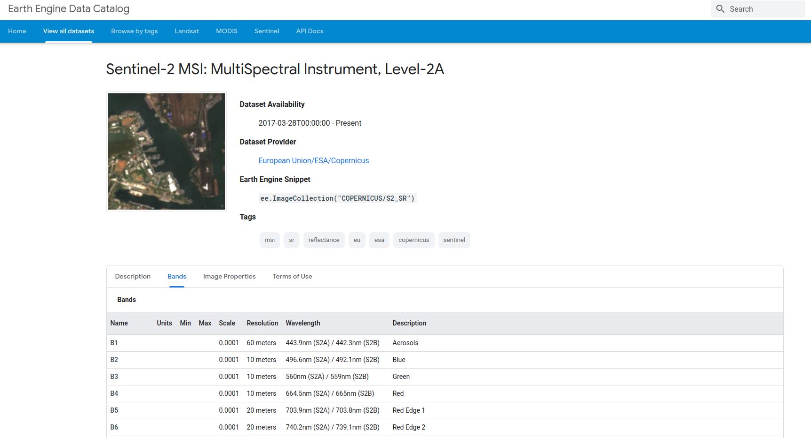
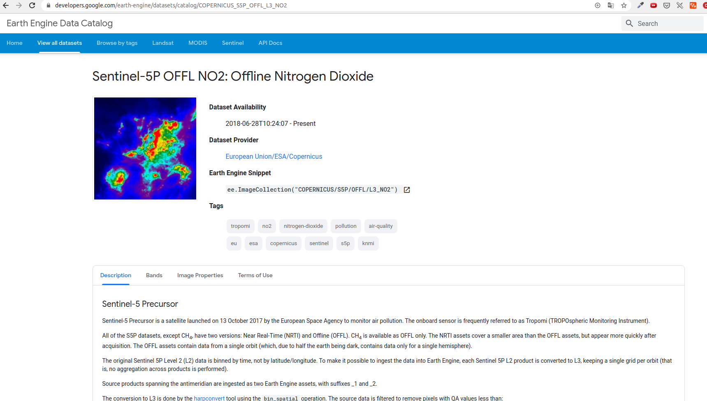
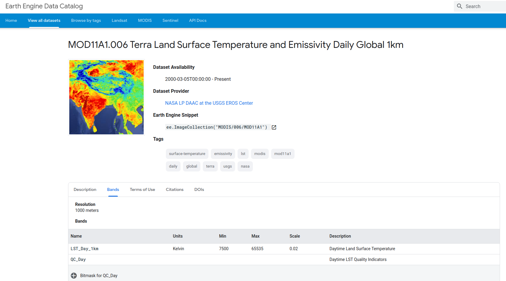

# Space Panthers project

## Description

# Main Data Sources

## `Global_Mobility_Report.csv`

|variable                                           |class     |description |
|:--------------------------------------------------|:---------|:-----------|
|country_region_code                                |character | country code |          
|country_region                                     |character | coutry region |
|sub_region_1                                       |character | name of sub region 1 |
|sub_region_2                                       |character | name of sub region 2 |
|date                                               |date      | date |
|retail_and_recreation_percent_change_from_baseline |integer   | percentage change of retail and recreaction |
|grocery_and_pharmacy_percent_change_from_baseline  |integer   | percentage change of grocery and pharmacy |
|parks_percent_change_from_baseline                 |integer   | percentage change of parks |
|transit_stations_percent_change_from_baseline      |integer   | percentage change of transit stations |
|workplaces_percent_change_from_baseline            |integer   | percentage change of workplaces |
|residential_percent_change_from_baseline           |integer   | percentage change of residential |
 
[Google Mobility](https://www.google.com/covid19/mobility/) acessed em 30/05/2020

# Shapefiles of the administrative areas

|File          |description     |
|:-------------|:---------------|
|BRA_adm.zip   | Brazil |
|DEU_adm.zip   | Germany |
|HKG_adm.zip   | Hong Kong |
|JPN_adm.zip   | Japan |
|NY.zip        | New York - USA |
|SP.zip        | Sao Paulo state - Brazil |
|SWE.zip       | Sweden |
|USA.zip       | United States of America |

[Shapefiles](https://www.diva-gis.org/gdata)

# Atmospheric Data

## Source: Sentinel 5

The Sentinel-5 Precursor mission instrument collects data useful for assessing air quality. The TROPOMI instrument is a multispectral sensor that records reflectance of wavelengths important for measuring atmospheric concentrations of ozone, methane, formaldehyde, aerosol, carbon monoxide, nitrogen oxide, and sulphur dioxide, as well as cloud characteristics at a spatial resolution of 0.01 arc degrees.

|Data                |Description     | Product
|:-------------------|:---------------|:------------------------------------- |
| Sentinel 5P - CH4  | Atmospheric methane (CH₄) concentration | 'COPERNICUS/S5P/OFFL/L3_CH4' |
| Sentinel 5P - CO   | Concentrations of Carbon monoxide (CO) |  'COPERNICUS/S5P/OFFL/L3_CO' |
| Sentinel 5P - HCHO | Formaldehyde concentration | 'COPERNICUS/S5P/OFFL/L3_HCHO' | 
| Sentinel 2 - NIR   | Near infra red | 'COPERNICUS/S2_SR' |
| Sentinel 5P - NO2  | Total, tropospheric, and stratospheric nitrogen dioxide concentration |  'COPERNICUS/S5P/OFFL/L3_NO2' |
| Sentinel 5P - SO2  | Atmospheric sulphur dioxide (SO₂) concentration | 'COPERNICUS/S5P/OFFL/L3_SO2' |
| Modis - Temp       | Temperature | 'MODIS/006/MOD11A1' |
| NOAA/VIIRS - Light | Light | 'NOAA/VIIRS/DNB/MONTHLY_V1/VCMSLCFG' |

Atmospheric data were used to infer human movement

[Sentinel 2](https://developers.google.com/earth-engine/datasets/catalog/COPERNICUS_S2_SR)

[Sentinel 5P](https://developers.google.com/earth-engine/datasets/catalog/COPERNICUS_S5P_NRTI_L3_AER_AI)

[Modis](https://developers.google.com/earth-engine/datasets/catalog/MODIS_006_MOD11A1)

# Team

- Antonio Leblanc - Software Developer
- Beatriz Campos - Economist
- Laurent Cheret - Telecom Engineer
- Ricardo Bull - Software Developer
- Samuel Souza Alcântara Queiroz - Firmware Developer
- Tiago de Conto - ?
